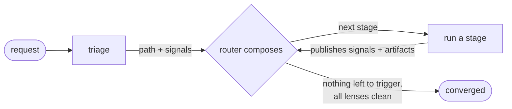

# Contributing to Alp River

This is the reference side of the river: how the plugin works inside, how the repo is laid out, and how to run it locally. For the tour aimed at adopters, start with the [README](README.md).

## 💻 Local development

Clone the repo and pass `--plugin-dir`:

```bash
git clone https://github.com/alp82/alp-river.git
claude --plugin-dir ./alp-river
```

## 🗂️ Structure

```
alp-river/
├── .claude-plugin/         <- plugin.json (version), marketplace.json
├── WORKFLOW.md             <- the full router-loop doctrine
├── doctrine/               <- CATALOG.md (stage schema), SIGNALS.md (signal vocabulary), ...
├── generated/catalog.json  <- compiled stage catalog (41 stages; tracked; the router reads it)
├── hooks/                  <- route.py (router), gen-catalog.py (compiler), *.sh (inject, format, context)
├── agents/                 <- 41 stage definitions + 1 off-route utility (explainer-prototyper)
└── commands/               <- 4 slash commands
```

## 🔧 Under the hood

The router is deterministic code (`hooks/route.py`) - it routes, it never reasons. A stage joins when one of its `subscribes` topics matches a live signal, filtered to the live path by its `routes`; run order is a topological sort of the `input`/`output` artifact dependencies. The catalog it reads (`generated/catalog.json`) is compiled from each agent's frontmatter by a save-time hook. The judgment lives in the stages - triage frames the work, each stage classifies its own findings.



Two rules never bend:

- **precedence** - a stage can't run before the artifacts it needs exist.
- **asymmetric rigor** - skipping a stage needs a positive signal; adding one needs only doubt. So safety and clarify stages stay in by default.

Two **locks** hold a step until it is safe to proceed:

- **TDD lock** on the code implementer - on a logic change, code can't start until the red tests are validated. Trivial changes skip it.
- **safety lock** on the system executor - a destructive or irreversible step is held until the safety gate gets your go-ahead.

**Convergence** - done when no signal triggers an unrun stage and every review lens is clean. Reviewer findings feed the fixer automatically. A SessionStart hook injects a small essentials block plus a pointer to `WORKFLOW.md`; after `/compact` it re-anchors that pointer so the router resumes deterministically.

## 🎬 Worked examples

### "Fix a typo in a doc comment"

Trivial change - single file, no new logic. The short path skips planning and tests entirely.

`code · XS · 3 stages`

- 🔎 **Intent**
  - ✓ triage
- 🔨 **Build**
  - ✓ code-implementer
- 🔬 **Review**
  - ✓ correctness

### "Fix this off-by-one in pagination"

A bug is a code task carrying a bug signal - it gets a root-cause hunt before the fix.

`code + bug · M · ~11 stages`

- 🔎 **Intent**
  - ✓ triage - tags the bug
- 🧭 **Scout**
  - ✓ code-investigator - finds the root cause
- 📐 **Blueprint**
  - ✓ code-planner
- 🧪 **Tests**
  - ✓ test-plan
  - ✓ test-author
  - ✓ test-review
- 🔨 **Build**
  - ✓ code-implementer
- 🔬 **Review**
  - ✓ correctness
  - ✓ simplicity
  - ✓ test-verifier
  - ✓ fixer - heals the findings

### "Add OAuth login"

A big code change - the full route, grouped by phase. This is what XXL looks like.

`code · XXL · ~18 stages`

- 🔎 **Intent**
  - ✓ triage
  - ✓ clarifier
- 🧭 **Scout**
  - ✓ reuse-scanner
  - ✓ health-checker
  - ✓ researcher
- 📐 **Blueprint**
  - ✓ code-planner
  - ✓ plan-challenger
- 🧪 **Tests**
  - ✓ test-plan
  - ✓ test-author
  - ✓ test-review
- 🔨 **Build**
  - ✓ code-implementer
- 🔬 **Review**
  - ✓ correctness
  - ✓ security - auth surface
  - ✓ … +15 more lenses
  - ✓ fixer - heals the findings

## 🏷️ Versioning and changelog

The plugin version lives in `.claude-plugin/plugin.json` and is mirrored in `.claude-plugin/marketplace.json` and the README version badge - bump all three together.
Changelog entry style is defined once, in `WORKFLOW.md` § "Changelog Style".
