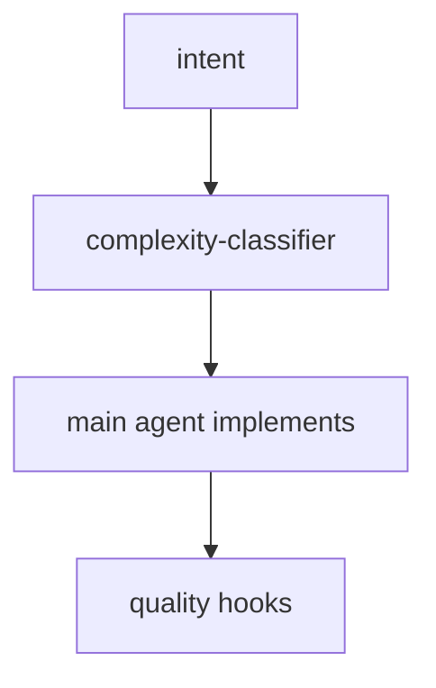
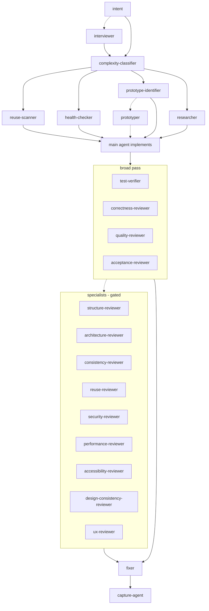
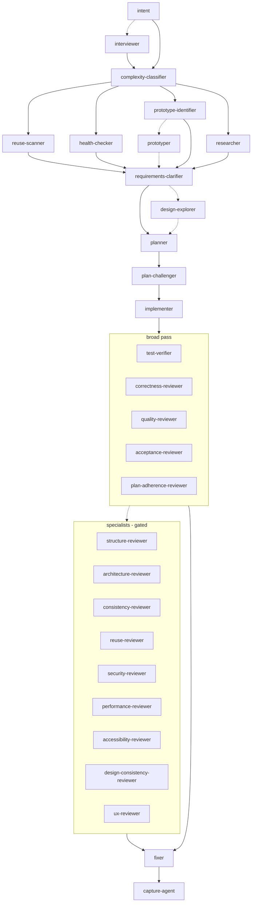
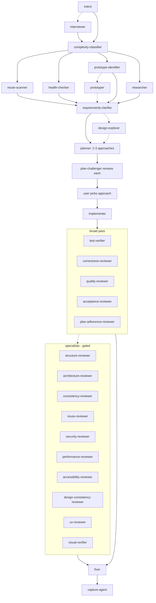

# Alp River

> *A river of agents, sized to the task.*

**Featured in:** [Alper Ortac's AI Stack](https://aistack.to/stacks/alper-ortac-unw0sl)

Multi-stage agent refinement for Claude Code, scaled by automatic complexity classification. Small changes pass quickly. Bigger ones add stages: clarification, planning, adversarial challenge, implementation, broad review, specialist review, self-heal.

The whole pipeline ships in one folder. Workflow, 32 subagents, 5 slash commands, 8 quality hooks.

## Latest updates

The last three versions:

**0.3.0** - Simplification: the four entry commands fold into one, and the assistant figures out what kind of work you mean from how you describe it.

- One command - `/alp-river:go` replaces the old `/feature`, `/plan`, `/investigate`, and `/fix`.
- The assistant figures out from your text whether it's a bug or a feature.
- On bigger tasks you get a Continue/Stop choice after the plan - design-only is one keystroke.
- Plain chat works without the command. Same pipeline either way.

**0.2.6**

- Every follow-up confirms intent first - even one-liners.
- UI design choices get a picker page you flip through, not a text debate.

**0.2.5**

- Acceptance criteria declare how they get verified - and the reviewer enforces it.
- Visual review is opt-in - one keystroke when you want it, silent when you don't.
- High-novelty work gets two prototypes side-by-side, not one.

Full history in [CHANGELOG.md](CHANGELOG.md).

## Install

In Claude Code:

```
/plugin marketplace add alp82/alp-river
/plugin install alp-river@alperortac
/reload-plugins
```

To pull updates later:
```
/plugin marketplace update alperortac
/reload-plugins
```

## How to use

Describe what you want - in plain text, or via `/alp-river:go` if you want a discoverable trigger. Both run the same pipeline; the workflow is already loaded, nothing to enable.

Step 0 reads your request and picks the framing: bug-shaped requests ("why is X broken", a stack trace, a symptom) take the diagnose path (investigator runs alone in pre-flight); everything else takes the build path (full pre-flight fan-out). On affirmation, the pipeline runs.

Each stage is run by a dedicated agent: classifier judges scope, scanners pre-flight the area, clarifier surfaces ambiguity, planner designs the approach, challenger pokes holes, implementer builds, reviewers cross-check, fixer heals findings.

You stay in the loop at a few well-defined moments:

- **Intent confirmation** (always, every tier - including S follow-ups) - confirm or correct the one-sentence read. A bare affirmation (`yes`/`correct`/`proceed`) rolls; anything else - your own words, additions, corrections - is treated as a reshape and spawns the interviewer with that reply as the new input. The interviewer loops with you (cap 5 rounds) until intent settles and no new aspects emerge.
- **Clarifier questions** (M/L/XL when ambiguity remains) - the clarifier researches the codebase first, then asks only what's still open. It loops with you (cap 5 rounds) until clarity is reached, then the planner runs.
- **Design picker** (when the clarifier flags UI design choice with multiple legitimate shapes) - the design-explorer agent confirms which parameters to expose, builds an interactive page (sandbox or real-page behind a dev gate), and waits for you to copy a labeled key-value spec back into chat. That spec becomes binding for the planner.
- **Plan selection** (XL) - pick one of the proposed approaches.
- **After-plan stop** (L/XL whenever a plan was produced) - Continue-build (default) to roll into implementation, or Stop to keep the run as a design pass.
- **After-diagnose stop** (on bug-framing) - Continue-fix or Continue-plan to roll into the fix path at the right tier, or Stop to keep just the diagnosis. On Continue, you restate the outcome in your own words first - the investigator's report stays on screen but is never silently consumed as intent.

Everything else runs to completion. Reviewer findings feed the fixer automatically.

Override the grade with natural language: *treat this as L*, *skip clarify*, *go straight to plan*.

## How the river flows

A complexity classifier reads each task and grades it **S**, **M**, **L**, **XL**, or **XXL**. The grade decides which stages run. XXL is a pushback - the classifier judges the task too big for one run and proposes a decomposition before any other gate fires.

A SessionStart hook reads `WORKFLOW.md` and injects it into every Claude session as foundational context. The workflow is always loaded, no per-file imports, no skill matching. After `/compact`, it fires again to restore the workflow plus the canonical state (intent, classification, approved plan).

In every diagram below, **dotted edges are conditional** (a gate fires the agent only when its trigger matches).

## S - small

Main agent implements directly. Quality hooks fire on edits.



## M - medium

Pre-flight scans run in parallel. Implementation, then broad review fan-out, then conditional specialists, then self-heal.



## L - large

Adds clarification, planning, and adversarial challenge. Implementer subagent takes the build. Plan-adherence-reviewer joins the broad pass.



## XL - extra large

Planner presents 2-3 approaches. Challenger reviews each. User picks. Visual verifier joins the specialist pass for UI changes.



## Agents

32 subagents organized by phase of work. Italic = conditional / gated. Tier shows the model that runs by default.

### Understand (Steps 0-1)

| Agent | Tier | Role |
|-------|------|------|
| *interviewer* | opus | Level 2 intent - probes scope, users, success criteria when the request has multiple readings or the Level 1 answer shifts scope. |
| complexity-classifier | opus | Grades each task S / M / L / XL / XXL and gates which downstream stages run. On XXL, returns a suggested decomposition the main agent surfaces as a pushback (split / treat-as-XL / abandon). |

### Prepare (Steps 2-3)

| Agent | Tier | Role |
|-------|------|------|
| reuse-scanner | sonnet | Finds reusable code and quick-win refactors before implementation. |
| health-checker | haiku | Scores code-health of the touched area, surfaces cleanup targets. |
| prototype-identifier | haiku | Flags external APIs / SDK novelty that need a tracer bullet. Tags each target with NOVELTY (low/med/high); on high, also suggests two alternative shapes for the prototyper to build side-by-side. |
| researcher | haiku | Pulls library / framework / domain knowledge from the web. |
| *prototyper* | sonnet | Builds tracer-bullet prototypes in `.prototypes/` when prototype-identifier flags external surface. On high-novelty targets, builds two differently-shaped tracers side-by-side and reports an evidence-based comparison. |
| requirements-clarifier | opus | Surfaces ambiguity, edge cases, and proposed acceptance criteria as a numbered question list before the planner runs. |

### Design (Steps 3.5-5)

| Agent | Tier | Role |
|-------|------|------|
| *design-explorer* | opus | Step 3.5 - fires when the clarifier flags a UI task with multiple legitimate visual or interaction shapes. Confirms which parameters to expose as controls, decides whether to host the picker in a sandbox prototype or in the real page behind a dev gate, writes the interactive page with a copy-spec button, and hands the labeled key-value spec the user paste-backs to the planner as binding input. |
| planner | opus | Designs the implementation blueprint. On XL, presents 2-3 approaches with a recommendation. Attaches a validation type (test/manual/observable) to every acceptance criterion. Reads `<LOCKED_DESIGN_SPEC>` when the design loop ran and builds to that spec. |
| plan-challenger | opus | Adversarial review - pokes holes, names failure modes, proposes simpler alternatives. |

### Build (Step 6)

| Agent | Tier | Role |
|-------|------|------|
| implementer | opus | Executes the approved plan on L/XL. Can kick back to planner via tiered escalation. |

### Verify (Steps 7-9)

**Broad pass** - runs in parallel on every M/L/XL.

| Agent | Tier | Role |
|-------|------|------|
| test-verifier | sonnet | Runs the project's test suite, fails fast. |
| correctness-reviewer | sonnet (M) / opus (L/XL) | Bugs, type holes, dead code, project convention adherence. |
| quality-reviewer | opus | Engineering judgment - hacky shortcuts, bloat, wrong tool for the job, unelegant solutions. Reads imports and deps first. |
| acceptance-reviewer | opus | Verifies every requirement and acceptance criterion maps to actual code AND that the plan's declared validation per criterion is in place (test exists, observable is at the named location, manual is flagged for the user); flags scope drift. |
| *plan-adherence-reviewer* | sonnet | L/XL only. Checks the implementer followed the plan's file list, signatures, and ordering. |

**Specialist pass** - fires only when its trigger matches: a broad-pass finding in its domain, or touched files inside its scope.

| Agent | Tier | Trigger |
|-------|------|---------|
| structure-reviewer | sonnet | Broad pass flagged structure / boundaries; or files / functions over size thresholds. |
| architecture-reviewer | opus | Touched files introduce new exports / wrappers / seams; or broad pass flagged shallow abstraction. Uses depth + the deletion test. |
| consistency-reviewer | sonnet | Touched files affect naming / error handling / return-shape patterns. |
| reuse-reviewer | sonnet | Broad pass flagged duplication; or new code resembles existing utilities. |
| security-reviewer | opus | Touched files include auth / permissions / session / input handling. |
| performance-reviewer | sonnet | Touched files include database / query / hot-path code. |
| accessibility-reviewer | sonnet | Touched files include UI components. |
| design-consistency-reviewer | sonnet | Touched files include UI components. |
| ux-reviewer | sonnet | Touched files include UI components. |
| visual-verifier | sonnet | UI touched; inline Y/n offer at the specialist pass (default yes on XL, default no on M/L). Uses playwright-cli to screenshot and verify. |

**Self-heal** - applies fixes once the broad and specialist passes have produced findings.

| Agent | Tier | Role |
|-------|------|------|
| fixer | sonnet (M) / opus (L/XL) | Applies targeted fixes for aggregated findings. Emits a re-run set. |

### Capture (Steps 10-11)

| Agent | Tier | Role |
|-------|------|------|
| capture-agent | opus | Collects novel project-context items (glossary terms, stack/intent drift) surfaced incidentally by upstream agents. Two phases - proposes, then writes after user approval. Never creates `docs/`. |

### Bias-conditional and separate flows

| Agent | Tier | Role |
|-------|------|------|
| investigator | opus | Root-cause debugging - forms hypotheses, attempts minimal repro, traces to the actual cause. Stops at diagnosis; outputs complexity + severity for the after-diagnose stop's picker (Continue-fix on S/M, Continue-plan on L/XL/XXL, or Stop). Fires in the main pipeline at Step 2 whenever Step 0 detected bug-framing. |
| setup-agent | opus | Interactive bootstrap of docs/INTENT.md, docs/STACK.md, docs/GLOSSARY.md via 5-invocation guided interview. Used by `/alp-river:setup`. |
| adr-drafter | opus | Drafts a single ADR from a decision summary, mirroring the canonical template. Read-only - emits a draft or hard-rejects on duplicates of active ADRs. Used by `/alp-river:adr`. |

## Slash commands

```
/alp-river:go           Run the pipeline. Bias detected from your text, tier classified, stops at natural seams.
/alp-river:setup        Interactive bootstrap of docs/INTENT.md, docs/STACK.md, docs/GLOSSARY.md
/alp-river:adr          Draft and write a single architectural decision record
/alp-river:review       Review current changes for correctness + engineering quality
/alp-river:verify       Visual verification of UI changes via playwright-cli
```

## Structure

```
alp-river/
├── .claude-plugin/plugin.json
├── WORKFLOW.md            <- pipeline + reviewer contract
├── hooks/
│   ├── hooks.json         <- 7 events: SessionStart, PreToolUse, PostToolUse, ...
│   └── *.sh               <- inject-workflow, auto-format, block-git-writes, ...
├── agents/                <- 32 subagent definitions
├── commands/              <- 5 slash commands
└── templates/             <- copy into your project's docs/ for project-context injection
```

## Local development

Clone the repo and pass `--plugin-dir`:

```bash
git clone https://github.com/alp82/alp-river.git
claude --plugin-dir ./alp-river
```

## Author

Alper Ortac &middot; [x.com/alperortac](https://x.com/alperortac)
