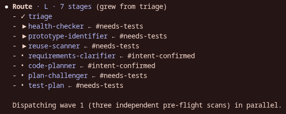
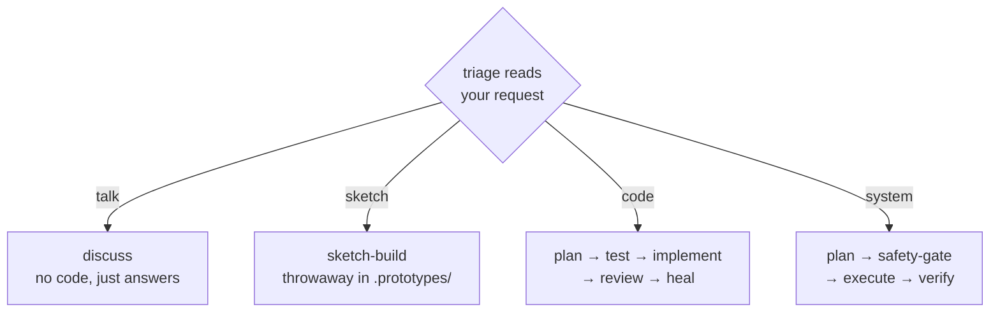

<div align="center">

# 🌊 Alp River

## A river of agents, composed to the task


<br>

### **Routes itself** · **Plans** · **Tests first** · **Reviews in parallel** · **Self-heals**

<br>



<br>

**Featured in:** [Alper Ortac's AI Stack](https://aistack.to/stacks/alper-ortac-unw0sl)

</div>

## Latest updates

The last three updates:

**1.2.6**

- A new command reports a health scorecard for the workflow itself, ranked by the fixes that would help most.
- Reflection can now review saved notes against their conventions and capture new ones, proposing each change for approval before writing.
- Code review now names the specific silent-failure traps it checks for, so swallowed errors and missing timeouts get caught.

**1.2.5**

- The per-turn pipeline status now renders as formatted text, so its step icons and progress markers show reliably instead of as raw monospace.
- The plain-language plan summary shown before approval now reads as formatted prose rather than a monospace block.

**1.2.4**

- Code review now flags unsafe database migrations - non-reversible changes, constraints added without a backfill, and renames that break instances still running during a rollout.
- The build and test completion checks are more reliable, so a failing build or suite can no longer slip through to a clean finish.

Full history in [CHANGELOG.md](CHANGELOG.md).

## Install

In Claude Code:

```
/plugin marketplace add alp82/alp-river
/plugin install alp-river@alperortac
/reload-plugins
```

To pull updates later:
```
/plugin marketplace update alperortac
/reload-plugins
```

The pointer resolves to the plugin's installed path. If your setup restricts file reads, allow the agent to read the plugin's doctrine - on a standard install add `Read(~/.claude/plugins/cache/alperortac/alp-river/**)` to your `.claude/settings.json` allowlist.

## How it works

No commands required. Describe what you want in plain text - or use `/alp-river:go` for a discoverable trigger. Both run the same workflow.

Triage reads your request and picks one of four conversation types. A deterministic router then runs only the stages that type needs, and pulls in more only when the work reveals it needs them - discover no email infra and a research stage joins; a plan that signs tokens pulls in a security lens. Size (XS-XXL) is just how many stages the route ended up with.



| Path | You're... | What it leaves behind |
|------|-----------|------------------------|
| **talk** | thinking out loud, asking, weighing options | nothing - answers, worked examples, tradeoffs. Reads freely; only expensive moves (a web search, a diagram) ask first. |
| **sketch** | trying an idea fast | a throwaway artifact in `.prototypes/` - code, a diagram, or a UI mockup. Relaxed ceremony; correctness and security still apply. |
| **code** | changing the codebase | a reviewed, tested change in your repo. The full route: clarify, plan, challenge, red tests, implement, review fan-out, self-heal. A large change proceeds as verified milestones - each built, reviewed, and confirmed before the next. |
| **system** | changing the machine (configs, troubleshooting, CLI tooling) | a verified change, with a safety check before anything destructive or irreversible. |

### Where you stay in the loop

You're pulled in only at decisions that could change the outcome:

- **Intent** - a clear ask gets a one-line read and proceeds; you correct it in your next message. A genuinely ambiguous ask sends the interviewer to loop with you until intent settles.
- **Clarifier questions** - researches the codebase first, then asks only what's still open.
- **Design picker** - for UI with multiple legitimate shapes, builds an interactive page; you paste back the chosen spec.
- **Cost / plan / safety gates** - fire only when the route turns expensive, a plan is ready, or a destructive step is queued. Never as fixed ceremony.

Everything else runs to convergence: done when no signal triggers an unrun stage and every review lens is clean. Reviewer findings feed the fixer automatically.

## Examples

### "Rename a variable across the module"

Trivial code change - plan, write, check, done.

```text
code · S · 4 stages
  triage
  code-planner
  code-implementer
  correctness-reviewer  ✓
```

### "Fix this off-by-one in pagination"

A bug is a code task carrying a bug signal - it gets a root-cause hunt before the fix.

```text
code + bug · M · ~9 stages
  triage               tags the bug
  code-investigator    finds the root cause
  code-planner
  code-implementer
  Review
    correctness
    regression + reuse lenses
  fixer  ✓
```

### "Set up nginx as a reverse proxy"

System work - ordered, reversible steps, with a safety check before the destructive one.

```text
system · M · 5 stages
  triage
  system-planner    ordered steps + rollback
  safety-gate       ← holds the destructive step
  system-executor
  system-verifier  ✓
```

### "What's the cleanest way to structure this module?"

Pure discussion - options and tradeoffs, nothing written.

```text
talk · XS · 2 stages
  triage
  discuss    options + tradeoffs, no code
```

### "Add OAuth login"

A big code change - the full route, grouped by stage. This is what XXL looks like.

```text
code · XXL · 18 stages
  Intent
    triage
    interviewer
    requirements-clarifier
  Scout
    reuse-scanner
    health-checker
    researcher
  Blueprint
    code-planner
    plan-challenger
  Tests (red first)
    test-plan
    test-author
    test-review
  Build
    code-implementer
  Review (parallel fan-out)
    correctness · quality · architecture · …
    security-reviewer   ← auth surface
  Heal
    fixer  ✓
```

## Stages

47 composable stages plus a command-only setup agent. Each declares its routes and data/signal contract in frontmatter (see `doctrine/CATALOG.md`, `doctrine/SIGNALS.md`). Below they are grouped by conversation path; a stage that runs in several paths appears under each.

### Code

```text
🔎 Intent
🧭 Scout
📐 Blueprint
🧪 Tests
🔨 Build
🔬 Review
📓 Document
```

🔎 **Intent** - reads the request, settles what you actually want, and frames the work.

| Stage | Model | Role |
|-------|-------|------|
| triage | haiku | Always-on. Reads your request, picks the path, sniffs early risk and bug-framing. |
| interviewer | opus | When the ask is ambiguous, probes scope and success criteria, looping until intent settles. |
| requirements-clarifier | opus | Researches the area, then surfaces edge cases and proposed acceptance criteria before planning. |

🧭 **Scout** - surveys the ground: what to reuse, how healthy the area is, what novelty needs a tracer-bullet first.

| Stage | Model | Role |
|-------|-------|------|
| reuse-scanner | sonnet | Finds reusable code and quick wins; flags duplication and missing infra. |
| health-checker | haiku | Scores the health of the area you're touching and surfaces cleanup targets. |
| prototype-identifier | haiku | Flags unfamiliar APIs or SDKs and suggests shapes to try first. |
| code-prototyper | sonnet | Builds a tracer-bullet against the real API/integration (algorithm correctness as a mode) to de-risk novelty before planning. |
| data-prototyper | sonnet | Tries competing schemas/data shapes against real samples and writes a human-reference report. |
| performance-prototyper | sonnet | Measures timing/scale-critical unknowns with a runnable and a charted report. |
| researcher | haiku | Pulls library, framework, and domain knowledge from the web. |

📐 **Blueprint** - turns settled intent into a concrete blueprint, then attacks it adversarially.

| Stage | Model | Role |
|-------|-------|------|
| design-prototyper | opus | For UI with multiple legitimate visuals, builds an interactive picker; you paste back the chosen spec. |
| ux-prototyper | opus | For multiple legitimate user flows, builds a clickable wireflow; you paste back the chosen flow spec. |
| code-planner | opus | Turns intent into a concrete step-by-step blueprint. |
| plan-challenger | opus | Adversarial review of the plan: holes, failure modes, simpler alternatives. |

🧪 **Tests** - derives the test cases and writes them red, validated against intent before any code is allowed.

| Stage | Model | Role |
|-------|-------|------|
| test-plan | sonnet | Derives concrete test cases from the plan's acceptance criteria. |
| test-author | sonnet | Writes the failing (red) tests before any implementation exists. |
| test-review | opus | Validates the red tests against intent, then releases the implementer. |

🔨 **Build** - builds the change to the plan, diagnoses bugs at their root, and gates anything destructive.

| Stage | Model | Role |
|-------|-------|------|
| code-implementer | opus | Executes the approved plan. Held by the TDD lock until tests are validated. |
| code-investigator | opus | Root-cause debugging for a bug: hypothesizes, repros, traces; stops at the diagnosis. |
| fixer | sonnet | Applies reviewer findings and reruns the lenses it touched until clean. |
| safety-gate | sonnet | Before anything destructive or irreversible, shows what is at stake and waits for your go-ahead. Sticky. |

🔬 **Review** - scrutinizes every diff in parallel: correctness always, the rest as the change demands.

| Lens | Model | Runs when |
|------|-------|-----------|
| correctness | opus | every change |
| quality | opus | logic changes |
| acceptance | sonnet | logic changes |
| plan-adherence | sonnet | logic changes |
| naming-clarity | sonnet | logic changes |
| assumptions | opus | logic changes |
| structure | sonnet | logic changes |
| architecture | opus | logic changes |
| consistency | sonnet | logic changes |
| reuse | sonnet | logic changes |
| performance | sonnet | logic changes |
| test-gap | sonnet | logic changes |
| test-verifier | sonnet | logic changes |
| security | opus | auth / secrets / permissions surface (sticky) |
| ux | sonnet | UI touched |
| accessibility | sonnet | UI touched |
| design-consistency | sonnet | UI touched |
| visual-verifier | sonnet | opt-in |

📓 **Document** - records the glossary, stack, and intent updates the run surfaced, only after you approve.

| Stage | Model | Role |
|-------|-------|------|
| capture-agent | opus | Proposes glossary / stack / intent updates surfaced during the run; writes only after your approval. |
| adr-drafter | opus | Drafts a single ADR from a decision summary. Backs `/alp-river:adr`. |

### System

```text
🔎 Intent
🖥️ System
🔬 Review
```

🔎 **Intent** - triage frames system intent directly and picks the path.

| Stage | Model | Role |
|-------|-------|------|
| triage | haiku | Always-on. Reads your request, picks the path, sniffs early risk and bug-framing. |

🖥️ **System** - plans, runs, and verifies OS-level changes, holding any destructive step behind a safety check.

| Stage | Model | Role |
|-------|-------|------|
| system-planner | opus | Plans an OS-level change as ordered, reversible steps with backup and rollback. |
| system-executor | sonnet | Runs the plan one step at a time. Held by the safety lock before destructive steps. |
| system-verifier | sonnet | Confirms the change actually reached its intended state. |
| system-investigator | sonnet | Root-cause diagnosis for OS-level faults from service state, logs, and configs. |
| safety-gate | sonnet | Before anything destructive or irreversible, shows what is at stake and waits for your go-ahead. Sticky. |

🔬 **Review** - one lens guards the system path when it touches sensitive surface.

| Lens | Model | Runs when |
|------|-------|-----------|
| security | sonnet | any system change that touches auth/secrets/permissions (sticky) |

### Talk

```text
🔎 Intent
🧭 Scout
💬 Discuss
📓 Document
```

🔎 **Intent** - reads the request and settles what you actually want before answering.

| Stage | Model | Role |
|-------|-------|------|
| triage | haiku | Always-on. Reads your request, picks the path, sniffs early risk and bug-framing. |
| interviewer | opus | When the ask is ambiguous, probes scope and success criteria, looping until intent settles. |

🧭 **Scout** - look before answering: existing code, health, research, UI options, or a root-cause trace.

| Stage | Model | Role |
|-------|-------|------|
| reuse-scanner | sonnet | Finds reusable code and quick wins; flags duplication and missing infra. |
| health-checker | haiku | Scores the health of the area you're touching and surfaces cleanup targets. |
| researcher | haiku | Pulls library, framework, and domain knowledge from the web. |
| design-prototyper | opus | For UI with multiple legitimate visuals, builds an interactive picker; you paste back the chosen spec. |
| ux-prototyper | opus | For multiple legitimate user flows, builds a clickable wireflow; you paste back the chosen flow spec. |
| code-investigator | opus | Root-cause debugging for a bug: hypothesizes, repros, traces; stops at the diagnosis. |
| system-investigator | sonnet | Root-cause diagnosis for OS-level faults from service state, logs, and configs. |

💬 **Discuss** - options with worked examples and tradeoffs, nothing written.

| Stage | Model | Role |
|-------|-------|------|
| discuss | opus | The talk path: options with worked examples and tradeoffs; never writes code. |

📓 **Document** - capture a decision the discussion reached, on request.

| Stage | Model | Role |
|-------|-------|------|
| adr-drafter | opus | Drafts a single ADR from a decision summary. Backs `/alp-river:adr`. |

### Sketch

```text
🔎 Intent
🔨 Build
🔬 Review
```

🔎 **Intent** - triage frames the throwaway and picks the path.

| Stage | Model | Role |
|-------|-------|------|
| triage | haiku | Always-on. Reads your request, picks the path, sniffs early risk and bug-framing. |

🔨 **Build** - throwaway runnable artifact in `.prototypes/`, relaxed ceremony.

| Stage | Model | Role |
|-------|-------|------|
| design-prototyper | opus | For UI with multiple legitimate visuals, builds an interactive picker; you paste back the chosen spec. |
| ux-prototyper | opus | For multiple legitimate user flows, builds a clickable wireflow; you paste back the chosen flow spec. |
| sketch-build | sonnet | The sketch path: throwaway runnable code in `.prototypes/`, relaxed ceremony. |
| fixer | sonnet | Applies reviewer findings and reruns the lenses it touched until clean. |

🔬 **Review** - correctness on every sketch; security if the surface demands it.

| Lens | Model | Runs when |
|------|-------|-----------|
| correctness | sonnet | every sketch |
| security | sonnet | sticky |

*`setup-agent` (opus) is command-only - it backs `/alp-river:setup` and is not part of any path.*

## Slash commands

```
/alp-river:go        Run the workflow. Triage routes the request; the router composes the stages it needs.
/alp-river:setup     Set up project-context docs (INTENT/STACK/GLOSSARY) in docs/ via guided interview.
/alp-river:adr       Manually draft and write an architectural decision record.
/alp-river:review    Review specified files for quality, bugs, duplication, and dead code.
/alp-river:verify    Visual verification of UI changes using playwright-cli screenshots.
/alp-river:reflect   Reflect on the current session to surface workflow friction worth tuning.
/alp-river:audit     Self-audit the plugin and report a health scorecard with top fixes.
```

## Structure

```
alp-river/
├── .claude-plugin/         <- plugin.json (version), marketplace.json
├── WORKFLOW.md             <- the full router-loop doctrine
├── doctrine/               <- CATALOG.md (stage schema), SIGNALS.md (signal vocabulary), ...
├── generated/catalog.json  <- compiled stage catalog (47 stages; tracked; the router reads it)
├── hooks/                  <- route.py (router), gen-catalog.py (compiler), *.sh (inject, format, context, reinject-state)
├── agents/                 <- 47 stage definitions + setup-agent
├── commands/               <- 7 slash commands
├── psychology/             <- per-agent voice / persona overrides
└── templates/              <- copy into your project's docs/ for context injection
```

## Under the hood

The router is deterministic code (`hooks/route.py`). A stage joins when one of its `subscribes` topics matches a live signal, filtered to the live path by its `routes`; run order is a topological sort of the `input`/`output` artifact dependencies. The catalog it reads (`generated/catalog.json`) is compiled from each agent's frontmatter by a save-time hook. The judgment lives in the stages - triage frames the work, each stage classifies its own findings - so the router never reasons. It just routes.


Two rules never bend:

- **precedence** - a stage can't run before the artifacts it needs exist.
- **asymmetric rigor** - skipping a stage needs a positive signal; adding one needs only doubt. So safety and clarify stages stay in by default.

Two **locks** hold a step until it is safe to proceed:

- **TDD lock** on the code implementer - on a logic change, code can't start until the red tests are validated. Trivial changes skip it.
- **safety lock** on the system executor - a destructive or irreversible step is held until the safety gate gets your go-ahead.

**Convergence** - the route is done when no signal triggers an unrun stage and every review lens is clean. Reviewer findings feed the fixer automatically.

A SessionStart hook injects a small essentials block plus a pointer to `WORKFLOW.md`; after `/compact` it re-anchors that pointer and restores the canonical run state so the router resumes deterministically.

## Local development

Clone the repo and pass `--plugin-dir`:

```bash
git clone https://github.com/alp82/alp-river.git
claude --plugin-dir ./alp-river
```

## Author

Alper Ortac &middot; [x.com/alperortac](https://x.com/alperortac)
