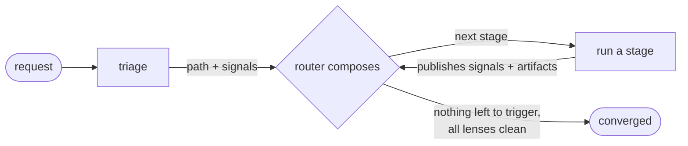
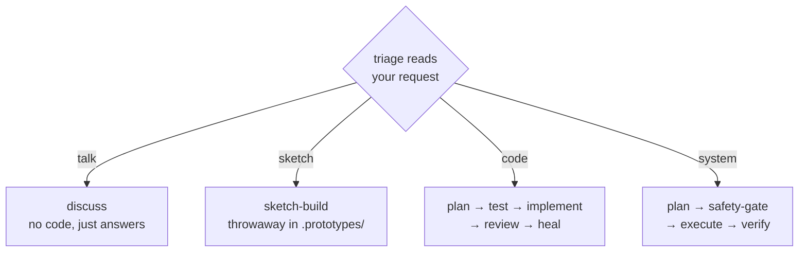

# Alp River

> *A river of agents, composed to the task.*

**Featured in:** [Alper Ortac's AI Stack](https://aistack.to/stacks/alper-ortac-unw0sl)

Multi-step agent refinement for Claude Code. You describe what you want; the plugin reads the request, picks how to handle it, and runs only the steps that request needs. A throwaway question stays out of your way. A real change earns clarification, planning, adversarial challenge, test-first implementation, review, and self-heal - and leaves a tested, reviewed result behind.

## Latest updates

The last three updates:

**1.1.1**

- A research or review step that gets stuck on a slow or unreachable source no longer hangs the workflow - it gives up on that step and either moves on or tells you.

**1.1.0**

The pipeline now recognizes four kinds of work instead of three, each routed to the steps it actually needs.

- Loose discussion stays fast and inline; a web search or a quick visual is offered before it runs, never forced.
- Throwaway exploration now spans code, diagrams, and mockups in one sandbox, not just code.
- System and OS-level work - configs, troubleshooting, command-line tooling - is its own track, with a safety check before anything destructive or irreversible runs.
- Independent checks now run in parallel instead of one after another, so results come back sooner.

**1.0.8**

- When the workflow reworks an earlier plan after a correction, it now amends that exact plan instead of redrafting it from scratch, so your prior decisions survive.
- When tests need a fix or fill, the existing tests are amended in place rather than rewritten, keeping the cases you already had.

Full history in [CHANGELOG.md](CHANGELOG.md).

## Conversation types

A path is defined by what it leaves behind. One look at your request picks a single path; a bug is a code or system task carrying a bug signal, not a path of its own.

| Path | You're... | What it leaves behind |
|------|-----------|------------------------|
| **talk** | thinking out loud, asking, weighing options | nothing - answers, worked examples, tradeoffs. Reads freely; only expensive moves (a web search, a diagram) ask first. |
| **sketch** | trying an idea fast | a throwaway artifact in `.prototypes/` - code, a diagram, or a UI mockup. Relaxed ceremony; correctness and security still apply. |
| **code** | changing the codebase | a reviewed, tested change in your repo. The full route: clarify, plan, challenge, red tests, implement, review fan-out, self-heal. |
| **system** | changing the machine (configs, troubleshooting, CLI tooling) | a verified change, with a safety check before anything destructive or irreversible. |

## How it works

Describe what you want in plain text, or via `/alp-river:go` for a discoverable trigger. Both run the same workflow. Triage reads your request and picks a path. A deterministic router then composes the route - the exact stages that path needs - and recomposes it as stages report what they find. Discover no email infra and a research and prototype stage join. A plan that signs tokens pulls in a security lens. Size (XS-XXL) is just a readout of how many stages the route ended up with.



Two rules keep the route honest:

- **precedence** - a stage can't run before the artifacts it needs exist.
- **asymmetric rigor** - skipping a stage needs a positive signal; adding one needs only doubt. So safety and clarify stages stay in by default.

Two **locks** hold a step until it is safe to proceed:

- **TDD lock** on the code implementer - on a logic change, code can't start until the red tests are validated. Trivial changes skip it.
- **safety lock** on the system executor - a destructive or irreversible step is held until the safety gate gets your go-ahead.

### Where you stay in the loop

You're pulled in only at decisions that could change the outcome:

- **Intent** - a clear ask gets a one-line read and proceeds; you correct it in your next message. A genuinely ambiguous ask sends the interviewer to loop with you until intent settles.
- **Clarifier questions** - researches the codebase first, then asks only what's still open.
- **Design picker** - for UI with multiple legitimate shapes, builds an interactive page; you paste back the chosen spec.
- **Cost / plan / safety gates** - fire only when the route turns expensive, a plan is ready, or a destructive step is queued. Never as fixed ceremony.

Everything else runs to convergence: done when no signal triggers an unrun stage and every review lens is clean. Reviewer findings feed the fixer automatically.

## Examples

- **"Rename this variable across the module"** -> code, trivial: plan, implement, correctness check. Size XS-S.
- **"Fix this off-by-one in pagination"** -> code + bug: triage tags the bug, the investigator finds the cause, the spine fixes it, reviewers confirm. Size S-M.
- **"Add OAuth login"** -> code: clarify, plan, challenge the plan, write red tests, implement, full review plus a security lens for the auth surface. Size L-XXL.
- **"What's the cleanest way to structure this module?"** -> talk: discuss lays out options with worked examples and tradeoffs, writes nothing. Size XS.
- **"Set up nginx as a reverse proxy"** -> system: plan with rollback, safety check before the destructive step, execute, verify the proxy actually serves. Size M-L.

## The four paths



Each path runs its own spine:

| Path | Spine |
|------|-------|
| talk | discuss (no code) |
| sketch | sketch-build -> correctness-reviewer |
| code | code-planner -> code-implementer -> review fan-out -> fixer |
| system | system-planner -> safety-gate -> system-executor -> system-verifier |

## Stages

44 composable stages plus a command-only setup agent. Each declares its routes and data/signal contract in frontmatter (see `doctrine/CATALOG.md`, `doctrine/SIGNALS.md`).

### Seed and intent

| Stage | Model | Role |
|-------|-------|------|
| triage | haiku | Always-on. Reads your request, picks the path, sniffs early risk and bug-framing. |
| interviewer | opus | When the ask is ambiguous, probes scope and success criteria, looping until intent settles. |
| requirements-clarifier | opus | Researches the area, then surfaces edge cases and proposed acceptance criteria before planning. |

### Pre-flight (code)

| Stage | Model | Role |
|-------|-------|------|
| reuse-scanner | sonnet | Finds reusable code and quick wins; flags duplication and missing infra. |
| health-checker | haiku | Scores the health of the area you're touching and surfaces cleanup targets. |
| prototype-identifier | haiku | Flags unfamiliar APIs or SDKs and suggests shapes to try first. |
| prototyper | sonnet | Builds a tracer-bullet against the real API to de-risk novelty before planning. |
| researcher | haiku | Pulls library, framework, and domain knowledge from the web. |

### Design and plan (code)

| Stage | Model | Role |
|-------|-------|------|
| design-explorer | opus | For UI with multiple legitimate shapes, builds an interactive picker; you paste back the chosen spec. |
| code-planner | opus | Turns intent into a concrete step-by-step blueprint. |
| plan-challenger | opus | Adversarial review of the plan: holes, failure modes, simpler alternatives. |

### Tests (TDD-first, code)

| Stage | Model | Role |
|-------|-------|------|
| test-plan | sonnet | Derives concrete test cases from the plan's acceptance criteria. |
| test-author | sonnet | Writes the failing (red) tests before any implementation exists. |
| test-review | opus | Validates the red tests against intent, then releases the implementer. |

### Code spine

| Stage | Model | Role |
|-------|-------|------|
| code-implementer | opus | Executes the approved plan. Held by the TDD lock until tests are validated. |
| code-investigator | opus | Root-cause debugging for a bug: hypothesizes, repros, traces; stops at the diagnosis. |
| fixer | sonnet | Applies reviewer findings and reruns the lenses it touched until clean. |

### System spine

| Stage | Model | Role |
|-------|-------|------|
| system-planner | opus | Plans an OS-level change as ordered, reversible steps with backup and rollback. |
| system-executor | sonnet | Runs the plan one step at a time. Held by the safety lock before destructive steps. |
| system-verifier | sonnet | Confirms the change actually reached its intended state. |
| system-investigator | sonnet | Root-cause diagnosis for OS-level faults from service state, logs, and configs. |
| safety-gate | sonnet | Before anything destructive or irreversible, shows what is at stake and waits for your go-ahead. Sticky. |

### Review lenses

Review lenses run over every diff and emit findings. On a trivial change only **correctness** runs; the rest of the band joins when the change carries real logic.

**Always-on band (13):** correctness (sonnet), quality (opus), acceptance (sonnet), plan-adherence (sonnet), naming-clarity (sonnet), assumptions (opus), structure (sonnet), architecture (opus), consistency (sonnet), reuse (sonnet), performance (sonnet), test-gap (sonnet), test-verifier (sonnet).

**Signal-gated (5):** security (sonnet, sticky - joins on an auth/secrets/permissions surface), ux (sonnet), accessibility (sonnet), design-consistency (sonnet) - the last three join when UI is touched; visual-verifier (sonnet) is opt-in.

### Capture

| Stage | Model | Role |
|-------|-------|------|
| capture-agent | opus | Proposes glossary / stack / intent updates surfaced during the run; writes only after your approval. |

### Other paths and entry points

| Stage | Model | Role |
|-------|-------|------|
| discuss | opus | The talk path: options with worked examples and tradeoffs; never writes code. |
| sketch-build | sonnet | The sketch path: throwaway runnable code in `.prototypes/`, relaxed ceremony. |
| adr-drafter | opus | Drafts a single ADR from a decision summary. Backs `/alp-river:adr`. |
| setup-agent | opus | Command-only (not a route stage). Bootstraps `docs/` via guided interview. Backs `/alp-river:setup`. |

## Install

In Claude Code:

```
/plugin marketplace add alp82/alp-river
/plugin install alp-river@alperortac
/reload-plugins
```

To pull updates later:
```
/plugin marketplace update alperortac
/reload-plugins
```

The pointer resolves to the plugin's installed path. If your setup restricts file reads, allow the agent to read the plugin's doctrine - on a standard install add `Read(~/.claude/plugins/cache/alperortac/alp-river/**)` to your `.claude/settings.json` allowlist.

## Slash commands

```
/alp-river:go        Run the workflow. Triage routes the request; the router composes the stages it needs.
/alp-river:setup     Set up project-context docs (INTENT/STACK/GLOSSARY) in docs/ via guided interview.
/alp-river:adr       Manually draft and write an architectural decision record.
/alp-river:review    Review specified files for quality, bugs, duplication, and dead code.
/alp-river:verify    Visual verification of UI changes using playwright-cli screenshots.
/alp-river:reflect   Reflect on the current session to surface workflow friction worth tuning.
```

## Structure

```
alp-river/
├── .claude-plugin/         <- plugin.json (version), marketplace.json
├── WORKFLOW.md             <- the full router-loop doctrine
├── doctrine/               <- CATALOG.md (stage schema), SIGNALS.md (signal vocabulary), ...
├── generated/catalog.json  <- compiled stage catalog (44 stages; tracked; the router reads it)
├── hooks/                  <- route.py (router), gen-catalog.py (compiler), *.sh (inject, format, context, reinject-state)
├── agents/                 <- 44 stage definitions + setup-agent
├── commands/               <- 6 slash commands
├── psychology/             <- per-agent voice / persona overrides
└── templates/              <- copy into your project's docs/ for context injection
```

## Local development

Clone the repo and pass `--plugin-dir`:

```bash
git clone https://github.com/alp82/alp-river.git
claude --plugin-dir ./alp-river
```

## Author

Alper Ortac &middot; [x.com/alperortac](https://x.com/alperortac)
