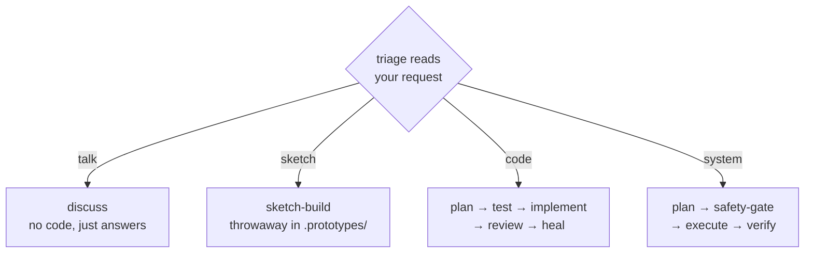

<div align="center">

# 🌊 Alp River

## A river of agents, composed to the task


<br>

### **Routes itself** · **Plans** · **Tests first** · **Reviews in parallel** · **Self-heals**

<br>

<!-- MEDIA SLOT 1: hero journey diagram | placement: centered, directly below the strapline | dimensions: width 800px (~800x300) | content: the seven stops as a stylized river flowing left-to-right with the stage emojis as waypoints | alt: "The alp-river journey: Intent, Scout, Blueprint, Tests, Build, Review, Ship" | format: png or animated gif -->

`🔎 Intent → 🧭 Scout → 📐 Blueprint → 🧪 Tests → 🔨 Build → 🔬 Review → 🚀 Ship`

<br>

**Featured in:** [Alper Ortac's AI Stack](https://aistack.to/stacks/alper-ortac-unw0sl)

</div>

---

## ⚡ Quick start

Install in Claude Code:

```
/plugin marketplace add alp82/alp-river
/plugin install alp-river@alperortac
/reload-plugins
```

To pull updates later:

```
/plugin marketplace update alperortac
/reload-plugins
```

Then:

1. Set your main session model to **Opus at high effort** (see the tip below).
2. Describe what you want in plain English, or run `/alp-river:go` - then respond only at the decision points.

> [!TIP]
> Run the main session on a top-tier model like Opus at high effort. The orchestrator drives every routing decision, so a weaker main model degrades the whole pipeline.

<div align="center">

<!-- MEDIA SLOT 2: run screenshot | placement: centered, directly below Quick start | dimensions: width 577 | content: existing docs/assets/intro-example.png, replaceable with a fresher run capture | alt: "alp-river composing a route for a task" | format: png -->


*What a composed run looks like*

</div>

<details>
<summary>

## 📰 Latest updates

</summary>

The last three updates:

**1.4.1**

- Questions on decisions that matter now state each option's pros and cons in plain words, alongside a concrete example of what picking it means.
- Options now point at the evidence behind them: an illustration file to open and the sources found during research.
- When a topic needs background, a short background doc can now be produced instead of only an interactive illustration.
- Routine yes/no confirmations stay as terse as before.

**1.4.0**

- The guided project-docs setup is gone: no more setup interview, no INTENT/STACK/GLOSSARY files injected into steps, and no session-start nudge to create them.
- The end-of-run capture step that proposed glossary and stack updates is gone.
- The architecture-decision-record command and its drafting step are gone.
- The crash-recovery state file written every turn is gone; after a compaction the workflow pointer is re-anchored and progress is reconciled from the working tree. One honest edge: a deliberately-red test turn that ends mid-run can now block once at the end-of-turn check before the retry cap lets it through.

**1.3.16**

- When a question is easier to grasp by seeing it - how parts fit together, how information is laid out, or a choice between options - the assistant now builds a small illustration first and asks with it in hand.

Full history in [CHANGELOG.md](CHANGELOG.md).

</details>

---

## 🗺️ The journey

Seven stops from headwater to sea. Each one-liner is the whole story; open a stop if you want to wade deeper.

### 🔎 Intent - the river reads the current before it moves

<!-- MEDIA SLOT 3: clarify-loop question card | placement: inside the Intent block, above the details fold-out | dimensions: width 700px | content: a clarify-loop question card screenshot | alt: "Clarifier asking a scoped question" | format: png -->

<details>
<summary>Wade in: how intent settles</summary>

| Stage | Model | Role |
|-------|-------|------|
| triage | haiku | Always-on. Reads your request, picks the path, flags early risk and bug-framing. |
| clarifier | opus | When the ask is ambiguous or under-specified, or simply bigger than a small tweak, researches the area, then confirms scope and success criteria and surfaces edge cases and acceptance criteria - one loop, both altitudes; exits immediately with zero questions when none are warranted. |

Where you stay in the loop:

- **Clarifier** - researches the codebase first, then asks only what's still open.
- **Cost / plan gates** - fire only when the route turns expensive or a plan is ready. Never as fixed ceremony.

</details>

<br/>

### 🧭 Scout - walks the banks before the water rises

What's reusable, how healthy the ground is, what novelty needs a tracer-bullet, and the root cause behind a bug.

<details>
<summary>Wade in: the full scouting party</summary>

| Stage | Model | Role |
|-------|-------|------|
| reuse-scanner | sonnet | Finds reusable code and quick wins; flags duplication and missing infra. |
| health-checker | haiku | Scores the health of the area you're touching and surfaces cleanup targets. |
| prototype-identifier | haiku | Flags unfamiliar APIs or SDKs and suggests shapes to try first. |
| code-prototyper | sonnet | Builds a tracer-bullet against the real API to de-risk novelty before planning. |
| data-prototyper | sonnet | Tries competing schemas against real samples and writes a reference report. |
| performance-prototyper | sonnet | Measures timing/scale-critical unknowns with a runnable and a charted report. |
| researcher | sonnet | Pulls library, framework, and domain knowledge from the web. |
| code-investigator | opus | Root-cause debugging for a bug: hypothesizes, repros, traces; stops at the diagnosis the planner consumes. |

</details>

<br/>

### 📐 Blueprint - a plan takes shape, then a challenger tries to sink it

<details>
<summary>Wade in: planning and its adversary</summary>

| Stage | Model | Role |
|-------|-------|------|
| design-prototyper | opus | For UI with multiple legitimate visuals, builds an interactive picker; you paste back the spec. |
| ux-prototyper | opus | For multiple legitimate user flows, builds a clickable wireflow; you paste back the flow spec. |
| code-planner | fable | Turns intent into a concrete step-by-step blueprint. |
| plan-challenger | fable | Adversarial review of the plan: holes, failure modes, simpler alternatives. |
| plan-arbiter | fable | On a multi-plan build, cross-reviews the competing plans; decides Adopt / Hybrid / Revise-first. |

Where you stay in the loop:

- **Design picker** - for UI with multiple legitimate shapes, builds an interactive page; you paste back the chosen spec.

</details>

<br/>

### 🧪 Tests - tests go red before code exists

<details>
<summary>Wade in: the red-first crew</summary>

| Stage | Model | Role |
|-------|-------|------|
| test-plan | sonnet | Derives concrete test cases from the plan's acceptance criteria. |
| test-author | sonnet | Writes the failing (red) tests before any implementation exists. |
| test-review | opus | Validates the red tests against intent, then releases the implementer. |

</details>

<br/>

### 🔨 Build - code flows only once the red tests are validated

<details>
<summary>Wade in: the build and its locks</summary>

| Stage | Model | Role |
|-------|-------|------|
| code-implementer | fable | Executes the approved plan. Held by the TDD lock until tests are validated. |
| safety-gate | sonnet | Before anything destructive or irreversible, shows what's at stake and waits for your go-ahead. Sticky. |

Where you stay in the loop:

- **Safety gate** - fires only when a destructive step is queued. Never as fixed ceremony.

</details>

<br/>

### 🔬 Review - every diff faces a panel of parallel lenses

<!-- MEDIA SLOT 4: parallel review lenses | placement: inside the Review block, above the details fold-out | dimensions: width 700px | content: parallel review lenses converging (screenshot or short gif) | alt: "Review lenses running in parallel" | format: png or gif -->

<details>
<summary>Wade in: all twelve lenses</summary>

| Lens | Model | Runs when |
|------|-------|-----------|
| correctness | opus | every change |
| simplicity | sonnet | planned builds |
| shape | opus | logic changes |
| conventions | sonnet | logic changes |
| acceptance | sonnet | logic changes |
| test-gap | sonnet | logic changes |
| test-verifier | sonnet | logic changes |
| performance | sonnet | perf surface touched |
| security | opus | auth / secrets / permissions surface (sticky) |
| ux | sonnet | UI touched |
| accessibility | sonnet | UI touched |
| design-consistency | sonnet | UI touched |

*Then `fixer` (sonnet) applies the reviewer findings, then re-runs the lenses whose findings it fixed plus correctness and the test suite until clean - the trailing heal line of Review.*

</details>

<br/>

### 🚀 Ship - the river reaches the sea: commit, push, draft PR - gated

<details>
<summary>Wade in: the last gate</summary>

| Stage | Model | Role |
|-------|-------|------|
| ship-gate | sonnet | Names the commit/push/PR commands and how to undo each, and waits for your go-ahead. Sticky. |
| ship-executor | sonnet | Composes one commit, pushes the branch, opens a draft PR. Held by the ship lock until the gate clears. |

</details>

---

<details>
<summary>🛤️ Other paths - System, Talk, Sketch</summary>

**🖥️ System** - changing the machine (configs, troubleshooting, CLI tooling) - leaves behind a verified change, destructive steps gated.

| Stage | Model | Role |
|-------|-------|------|
| system-planner | opus | Plans an OS-level change as ordered, reversible steps with backup and rollback. |
| system-executor | sonnet | Runs the plan one step at a time. Held by the safety lock before destructive steps. |
| system-verifier | sonnet | Confirms the change actually reached its intended state. |
| system-investigator | sonnet | Root-cause diagnosis for OS-level faults from service state, logs, and configs. |

**💬 Talk** - thinking out loud, asking, weighing options - leaves behind nothing written: answers, worked examples, tradeoffs. A 1-2 stage route, sharing the 🔎 Intent and 🧭 Scout stages with the code path.

**✏️ Sketch** - trying an idea fast - leaves behind a throwaway runnable in `.prototypes/`, relaxed ceremony. Shares the prototypers and the `correctness` / `security` lenses with the main journey.

</details>

---

## ⌨️ Slash commands

```
/alp-river:go        Run the workflow. Triage routes the request; the router composes the stages it needs.
/alp-river:review    Review specified files for quality, bugs, duplication, and dead code.
/alp-river:reflect   Reflect on the current session to surface workflow friction worth tuning.
/alp-river:audit     Self-audit the plugin and report a health scorecard with top fixes.
```

---

## 🌊 How it works

No commands required - describe what you want in plain text, or use `/alp-river:go`. Both run the same workflow.

Think of it as a packing list that fills itself:

1. **Triage picks the lane** - it reads your request and picks one of four conversation types.
2. **Stages subscribe to signals** - a stage joins the route the moment one of its flags fires.
3. **More flags pull in more stages** - the route grows as the work reveals itself: no email infra found pulls in research; a plan that signs tokens pulls in a security lens.
4. **Size (XS-XXL) is the final head-count** - a readout of how many stages the route ended up with, never a dial you set.

A worked example:

> *"Add rate limiting to the login endpoint"*
> → `code · needs-tests · significant-build · auth-surface`
> → each flag pulls its stages: red tests, a challenged plan, a security review
> → `code · L · 12 stages` → all clean → done.



---

Contributing / internals → [CONTRIBUTING.md](CONTRIBUTING.md)

---

## ✍️ Author

Alper Ortac &middot; [x.com/alperortac](https://x.com/alperortac)
