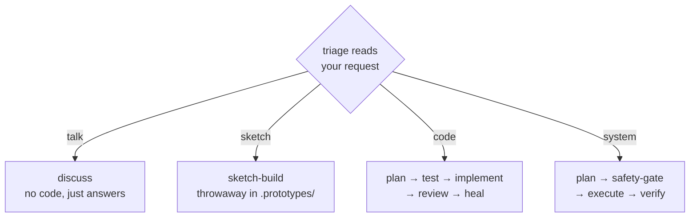

<div align="center">

# 🌊 Alp River

## A river of agents, composed to the task


<br>

### **Routes itself** · **Plans** · **Tests first** · **Reviews in parallel** · **Self-heals**

<br>


<br>

**Featured in:** [Alper Ortac's AI Stack](https://aistack.to/stacks/alper-ortac-unw0sl)

</div>

---

## 📰 Latest updates

The last three updates:

**1.3.8**

- An unclear request is now clarified in a single question-and-answer loop that keeps going until the goal is genuinely clear, instead of two separate loops that each stopped at a fixed number of rounds.

**1.3.7**

- A trivial code change - a single-file edit with no new logic, like a typo fix, a doc tweak, a config value, or a version bump - now takes a genuinely short path: it goes straight to making the change plus a correctness check, skipping the planning step it used to run first.
- Larger and logic-carrying changes are unaffected: they still get the full plan-and-review treatment.

**1.3.6**

- Finishing a reply that changed no files now skips the end-of-turn test and build checks entirely, saving up to about five minutes on chat-only turns; the checks still run after every real code edit.
- During an in-flight task run, the end-of-turn checks wait and run once at the finish instead of after every intermediate step.
- The after-save formatter no longer holds up the turn and never downloads formatter packages; projects without the formatter installed are skipped silently.

Full history in [CHANGELOG.md](CHANGELOG.md).

---

## ⚡ Quick start

Install in Claude Code:

```
/plugin marketplace add alp82/alp-river
/plugin install alp-river@alperortac
/reload-plugins
```

To pull updates later:

```
/plugin marketplace update alperortac
/reload-plugins
```

Then:

1. Set your main session model to **Opus at high effort** (see the tip below).
2. Describe what you want in plain English, or run `/alp-river:go` - then respond only at the decision points.

> [!TIP]
> Run the main session on a top-tier model like Opus at high effort. The orchestrator drives every routing decision, so a weaker main model degrades the whole pipeline.

---

## 🌊 How it works

No commands required - describe what you want in plain text, or use `/alp-river:go`. Both run the same workflow.

Think of it as a packing list that fills itself:

1. **Triage picks the lane** - it reads your request and picks one of four conversation types.
2. **Stages subscribe to signals** - a stage joins the route the moment one of its flags fires.
3. **More flags pull in more stages** - the route grows as the work reveals itself: no email infra found pulls in research; a plan that signs tokens pulls in a security lens.
4. **Size (XS-XXL) is the final head-count** - a readout of how many stages the route ended up with, never a dial you set.

A worked example:

> *"Add rate limiting to the login endpoint"*
> → `code · needs-tests · significant-build · auth-surface`
> → each flag pulls its stages: red tests, a challenged plan, a security review
> → `code · L · 12 stages` → all clean → done.



The spine of a code route, in the order it runs:

`🔎 Intent → 🧭 Scout → 📐 Blueprint → 🧪 Tests → 🔨 Build → 🔬 Review → 📓 Document`

### Where you stay in the loop

You're pulled in only at decisions that could change the outcome:

- **Intent** - a clear ask gets a one-line read and proceeds; an ambiguous one loops with the clarifier until intent settles.
- **Clarifier** - researches the codebase first, then asks only what's still open.
- **Design picker** - for UI with multiple legitimate shapes, builds an interactive page; you paste back the chosen spec.
- **Cost / plan / safety gates** - fire only when the route turns expensive, a plan is ready, or a destructive step is queued. Never as fixed ceremony.

---

## 🎬 Examples

### "Fix a typo in a doc comment"

Trivial change - single file, no new logic. The short path skips planning and tests entirely.

`code · XS · 3 stages`

- 🔎 **Intent**
  - ✓ triage
- 🔨 **Build**
  - ✓ code-implementer
- 🔬 **Review**
  - ✓ correctness

### "Fix this off-by-one in pagination"

A bug is a code task carrying a bug signal - it gets a root-cause hunt before the fix.

`code + bug · M · ~11 stages`

- 🔎 **Intent**
  - ✓ triage - tags the bug
- 🧭 **Scout**
  - ✓ code-investigator - finds the root cause
- 📐 **Blueprint**
  - ✓ code-planner
- 🧪 **Tests**
  - ✓ test-plan
  - ✓ test-author
  - ✓ test-review
- 🔨 **Build**
  - ✓ code-implementer
- 🔬 **Review**
  - ✓ correctness
  - ✓ simplicity
  - ✓ test-verifier
  - ✓ fixer - heals the findings

### "Add OAuth login"

A big code change - the full route, grouped by phase. This is what XXL looks like.

`code · XXL · ~18 stages`

- 🔎 **Intent**
  - ✓ triage
  - ✓ clarifier
- 🧭 **Scout**
  - ✓ reuse-scanner
  - ✓ health-checker
  - ✓ researcher
- 📐 **Blueprint**
  - ✓ code-planner
  - ✓ plan-challenger
- 🧪 **Tests**
  - ✓ test-plan
  - ✓ test-author
  - ✓ test-review
- 🔨 **Build**
  - ✓ code-implementer
- 🔬 **Review**
  - ✓ correctness
  - ✓ security - auth surface
  - ✓ … +15 more lenses
  - ✓ fixer - heals the findings

---

## Stages

The stages of a code build, grouped by phase in run order - the stage-to-phase membership the render card cites.

### 🔎 Intent

Reads the request, settles what you actually want, and frames the work.

*An ambiguous "make login better" loops with the clarifier until the goal is concrete.*

| Stage | Model | Role |
|-------|-------|------|
| triage | haiku | Always-on. Reads your request, picks the path, flags early risk and bug-framing. |
| clarifier | fable | When the ask is ambiguous or under-specified, researches the area, then confirms scope and success criteria and surfaces edge cases and acceptance criteria - one loop, both altitudes. |

---

### 🧭 Scout

Surveys the ground: what to reuse, how healthy the area is, what novelty needs a tracer-bullet first, and the root cause behind a bug.

*No email infra found, so a research stage joins.*

| Stage | Model | Role |
|-------|-------|------|
| reuse-scanner | sonnet | Finds reusable code and quick wins; flags duplication and missing infra. |
| health-checker | haiku | Scores the health of the area you're touching and surfaces cleanup targets. |
| prototype-identifier | haiku | Flags unfamiliar APIs or SDKs and suggests shapes to try first. |
| code-prototyper | sonnet | Builds a tracer-bullet against the real API to de-risk novelty before planning. |
| data-prototyper | sonnet | Tries competing schemas against real samples and writes a reference report. |
| performance-prototyper | sonnet | Measures timing/scale-critical unknowns with a runnable and a charted report. |
| researcher | sonnet | Pulls library, framework, and domain knowledge from the web. |
| code-investigator | fable | Root-cause debugging for a bug: hypothesizes, repros, traces; stops at the diagnosis the planner consumes. |

---

### 📐 Blueprint

Turns settled intent into a concrete blueprint, then attacks it adversarially.

*Two legitimate UI shapes? A picker page lets you choose before planning.*

| Stage | Model | Role |
|-------|-------|------|
| design-prototyper | fable | For UI with multiple legitimate visuals, builds an interactive picker; you paste back the spec. |
| ux-prototyper | fable | For multiple legitimate user flows, builds a clickable wireflow; you paste back the flow spec. |
| code-planner | fable | Turns intent into a concrete step-by-step blueprint. |
| plan-challenger | fable | Adversarial review of the plan: holes, failure modes, simpler alternatives. |
| plan-arbiter | fable | On a multi-plan build, cross-reviews the competing plans; decides Adopt / Hybrid / Revise-first. |

---

### 🧪 Tests

Derives the test cases and writes them red, validated against intent before any code is allowed.

*The acceptance criteria become failing tests that gate the implementer.*

| Stage | Model | Role |
|-------|-------|------|
| test-plan | sonnet | Derives concrete test cases from the plan's acceptance criteria. |
| test-author | sonnet | Writes the failing (red) tests before any implementation exists. |
| test-review | fable | Validates the red tests against intent, then releases the implementer. |

---

### 🔨 Build

Builds the change to the plan, and gates anything destructive.

*The implementer stays locked until the red tests are validated.*

| Stage | Model | Role |
|-------|-------|------|
| code-implementer | fable | Executes the approved plan. Held by the TDD lock until tests are validated. |
| safety-gate | sonnet | Before anything destructive or irreversible, shows what's at stake and waits for your go-ahead. Sticky. |

---

### 🔬 Review

Scrutinizes every diff in parallel: correctness always, the rest as the change demands.

*An auth-touching diff pulls in the security lens; clean lenses converge the route.*

| Lens | Model | Runs when |
|------|-------|-----------|
| correctness | fable | every change |
| simplicity | sonnet | planned builds |
| quality | fable | logic changes |
| acceptance | sonnet | logic changes |
| plan-adherence | sonnet | logic changes |
| naming-clarity | sonnet | logic changes |
| assumptions | fable | logic changes |
| structure | sonnet | logic changes |
| architecture | fable | logic changes |
| consistency | sonnet | logic changes |
| reuse | sonnet | logic changes |
| performance | sonnet | logic changes |
| test-gap | sonnet | logic changes |
| test-verifier | sonnet | logic changes |
| security | fable | auth / secrets / permissions surface (sticky) |
| ux | sonnet | UI touched |
| accessibility | sonnet | UI touched |
| design-consistency | sonnet | UI touched |

*Then `fixer` (sonnet) applies the reviewer findings and reruns the lenses it touched until clean - the trailing heal line of Review.*

---

### 📓 Document

Records the glossary, stack, and intent updates the run surfaced, only after you approve.

*A new term the run coined is proposed for the glossary - written only on your OK.*

| Stage | Model | Role |
|-------|-------|------|
| capture-agent | fable | Proposes glossary / stack / intent updates surfaced during the run; writes only after approval. |
| adr-drafter | fable | Drafts a single ADR from a decision summary. Backs `/alp-river:adr`. |

---

### 🚀 Ship

Opt-in at convergence: on a ship request, gates the forward git/gh commands, then commits, pushes, and opens a draft PR.

| Stage | Model | Role |
|-------|-------|------|
| ship-gate | sonnet | Names the commit/push/PR commands and how to undo each, and waits for your go-ahead. Sticky. |
| ship-executor | sonnet | Composes one commit, pushes the branch, opens a draft PR. Held by the ship lock until the gate clears. |

*`setup-agent` (fable) is command-only - it backs `/alp-river:setup` - and is not part of any path.*

---

## 🛤️ Other paths

### 🖥️ System

Changing the machine (configs, troubleshooting, CLI tooling) - leaves behind a verified change, destructive steps gated.

| Stage | Model | Role |
|-------|-------|------|
| system-planner | fable | Plans an OS-level change as ordered, reversible steps with backup and rollback. |
| system-executor | sonnet | Runs the plan one step at a time. Held by the safety lock before destructive steps. |
| system-verifier | sonnet | Confirms the change actually reached its intended state. |
| system-investigator | sonnet | Root-cause diagnosis for OS-level faults from service state, logs, and configs. |

*Shares `safety-gate` (🔨 Build) and the `security` lens (🔬 Review).*

### 💬 Talk

Thinking out loud, asking, weighing options - leaves behind nothing written: answers, worked examples, tradeoffs.

A 1-2 stage route renders flat, with no phase banners:

#### "What's the cleanest way to structure this module?"

`talk · XS · 2 stages`

- ✓ triage
- ✓ discuss - options + tradeoffs, no code

*Shares the 🔎 Intent and 🧭 Scout stages with the code path.*

### ✏️ Sketch

Trying an idea fast - leaves behind a throwaway runnable in `.prototypes/`, relaxed ceremony.

| Stage | Model | Role |
|-------|-------|------|
| sketch-build | sonnet | Throwaway runnable code in `.prototypes/`, relaxed ceremony. |

*Shares the prototypers (🧭 Scout / 📐 Blueprint), `fixer` and the `correctness` / `security` lenses (🔬 Review).*

---

## ⌨️ Slash commands

```
/alp-river:go        Run the workflow. Triage routes the request; the router composes the stages it needs.
/alp-river:setup     Set up project-context docs (INTENT/STACK/GLOSSARY) in docs/ via guided interview.
/alp-river:adr       Manually draft and write an architectural decision record.
/alp-river:review    Review specified files for quality, bugs, duplication, and dead code.
/alp-river:reflect   Reflect on the current session to surface workflow friction worth tuning.
/alp-river:audit     Self-audit the plugin and report a health scorecard with top fixes.
```

---

## 🗂️ Structure

```
alp-river/
├── .claude-plugin/         <- plugin.json (version), marketplace.json
├── WORKFLOW.md             <- the full router-loop doctrine
├── doctrine/               <- CATALOG.md (stage schema), SIGNALS.md (signal vocabulary), ...
├── generated/catalog.json  <- compiled stage catalog (50 stages; tracked; the router reads it)
├── hooks/                  <- route.py (router), gen-catalog.py (compiler), *.sh (inject, format, context, recover-state)
├── agents/                 <- 50 stage definitions + 1 off-route utility (setup-agent)
├── commands/               <- 6 slash commands
├── psychology/             <- per-agent voice / persona overrides
└── templates/              <- copy into your project's docs/ for context injection
```

---

## 🔧 Under the hood

The router is deterministic code (`hooks/route.py`) - it routes, it never reasons. A stage joins when one of its `subscribes` topics matches a live signal, filtered to the live path by its `routes`; run order is a topological sort of the `input`/`output` artifact dependencies. The catalog it reads (`generated/catalog.json`) is compiled from each agent's frontmatter by a save-time hook. The judgment lives in the stages - triage frames the work, each stage classifies its own findings.


Two rules never bend:

- **precedence** - a stage can't run before the artifacts it needs exist.
- **asymmetric rigor** - skipping a stage needs a positive signal; adding one needs only doubt. So safety and clarify stages stay in by default.

Two **locks** hold a step until it is safe to proceed:

- **TDD lock** on the code implementer - on a logic change, code can't start until the red tests are validated. Trivial changes skip it.
- **safety lock** on the system executor - a destructive or irreversible step is held until the safety gate gets your go-ahead.

**Convergence** - done when no signal triggers an unrun stage and every review lens is clean. Reviewer findings feed the fixer automatically. A SessionStart hook injects a small essentials block plus a pointer to `WORKFLOW.md`; after `/compact` it re-anchors that pointer and restores the canonical run state so the router resumes deterministically.

---

## 💻 Local development

Clone the repo and pass `--plugin-dir`:

```bash
git clone https://github.com/alp82/alp-river.git
claude --plugin-dir ./alp-river
```

---

## ✍️ Author

Alper Ortac &middot; [x.com/alperortac](https://x.com/alperortac)
